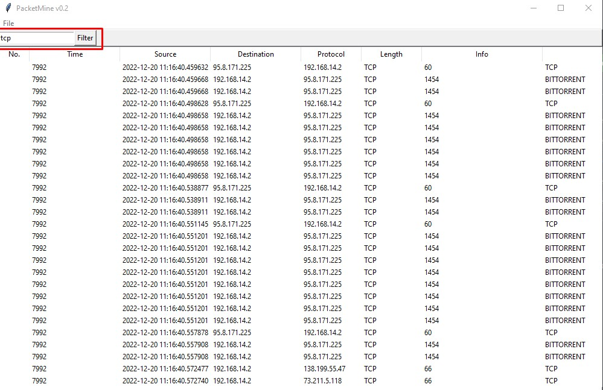

<h1>Open File Function</h1>

<h1>Display Information</h1>

<h1>Filter Information</h1>

This script is a simple packet analyzer tool that allows a user to open a PCAP file, view the packets contained in it, and filter the packets based on a specified filter string. The script utilizes the tkinter library for the GUI and pyshark for packet analysis.

The PacketInfo class is a helper class that extracts relevant information from a packet object and stores it in the object's attributes. The Application class is the main class of the script, and it contains the GUI elements and their corresponding functions.

The create_widgets method creates the menu bar, toolbar, and treeview that make up the GUI. The menu bar contains a single "File" menu with an "Open" option that allows the user to select a PCAP file to open. The toolbar contains a text entry field and a button that allow the user to enter a filter string and apply it to the packets, respectively. The treeview displays the packets and their information in a tabular format.

The on_open method is called when the user selects the "Open" option from the menu. It opens a file dialog to allow the user to select a PCAP file, and then it starts a new thread to read and process the packets from the file. The read_packets function is the function that runs in the new thread and it uses asyncio and pyshark to asynchronously iterate through the packets in the file and extract their information. The extracted information is then added to the treeview.

<code> pip install -r requirements.txt </code>
